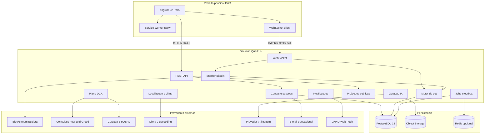

# Definição Técnica — Satoshi Pet Web

**Versão:** 1.1  
**Data:** 12/09/2026  
**Referência:** PRD v2.0, seções 16–18 e 23  
**Histórico:** 1.1 — decisão de execução 100% containerizada (§1.3, §2.4, §6, §11)

---

## 1. Princípio arquitetural

### 1.1 O PWA é o produto principal

O usuário interage exclusivamente com o **PWA Angular** instalável. O backend persiste estado, reconcilia a rede Bitcoin, calcula DCA, gera arte e projeta dados públicos/privados. Nenhuma funcionalidade crítica depende de aba aberta (PRD §2, princípio 5).

### 1.2 Desvio deliberado do PRD (frontend)

| Item | PRD §16.1 | Decisão deste backlog |
|------|-----------|------------------------|
| Frontend | React + TypeScript | **Angular 22 + TypeScript** |

**Motivo:** decisão do responsável pelo produto.  
**Ação sugerida:** registrar ADR `ADR-001-frontend-angular` ou atualizar PRD §16.1.

### 1.3 Decisão arquitetural — execução 100% containerizada

**Decisão:** todos os componentes do sistema executam em **containers** em todos os ambientes (local, staging e produção). Nenhum serviço é instalado diretamente no host.

| Componente | Imagem/container |
|------------|------------------|
| PWA Angular | Build estático servido por container (ex.: nginx) |
| API Quarkus | Container JVM (ou nativo GraalVM, se adotado) |
| PostgreSQL | Container oficial `postgres:18` |
| Object storage | Container MinIO (dev) ou serviço S3-compatível gerenciado (prod) |
| Redis (opcional) | Container oficial `redis` |
| Regtest Bitcoin | Container de teste (FUND-09) |
| Jobs/scheduler | Mesmo container da API (processo único com trava DB) |

**Orquestração:** Docker Compose no desenvolvimento; produção em containers (Compose ou Kubernetes, conforme orçamento) — sempre a partir das mesmas imagens versionadas.

**Motivo:** paridade entre ambientes, onboarding trivial (`docker compose up`), reprodutibilidade de build e deploy imutável.

**Ação sugerida:** registrar ADR `ADR-002-execucao-containerizada`.

### 1.4 Diagrama de arquitetura



---

## 2. Stack tecnológica

### 2.1 Produto principal — PWA Angular

| Componente | Versão / escolha | Notas |
|------------|------------------|-------|
| Angular | **22.1.5** (Active, suporte até jun/2028) | Standalone components, signals |
| TypeScript | **≥6.0.0 <6.1.0** | Conforme matriz angular.dev |
| Node.js | **^22.22.3 \|\| ^24.15.0 \|\| ^26.0.0** | Conforme matriz angular.dev |
| RxJS | **^7.4.0** | Streams, WebSocket |
| @angular/pwa | Incluso no CLI | Service worker `ngsw`, manifest |
| Angular CDK | 22.x | A11y, overlay, focus trap |
| Chart.js + ng2-charts | Última estável compatível | Gráficos dashboard |
| Canvas / CSS sprites | — | Pixel art do pet |
| Vitest ou Karma/Jasmine | — | Testes unitários frontend |

**Capacidades PWA obrigatórias (PRD §14.6):**

- `manifest.webmanifest` com ícones, `display: standalone`, `start_url`, `theme_color`
- Service worker com cache de assets estáticos e sprites aprovados
- Recuperação de sessão após fechamento
- Offline: estrutura + último estado com aviso; **sem** alterações financeiras offline
- Instalabilidade com fallback explicativo quando navegador não suporta
- Web Push conforme capacidade (incl. requisitos iOS/iPadOS — PRD §23)

### 2.2 Backend — Quarkus

| Componente | Versão / escolha | Notas |
|------------|------------------|-------|
| Java | **25 LTS** | Conforme PRD §16.1 |
| Quarkus | **3.33.3.2 LTS** | Produção; avaliar 3.40 LTS quando GA (set/2026) |
| REST | quarkus-resteasy-reactive ou RESTEasy Classic | API JSON |
| WebSocket | quarkus-websockets | Eventos tempo real |
| Hibernate ORM Panache | Incluso | Entidades §16.2 |
| Flyway | quarkus-flyway | Migrations versionadas |
| Scheduler | quarkus-scheduler + trava DB | Jobs 06h/07h/08h, monitor |
| Outbox | Padrão transacional | Publicação confiável de eventos |
| SmallRye Health | Métricas e health checks | Admin §17.3 |
| Testcontainers | Testes de integração | PostgreSQL, regtest |

### 2.3 Banco de dados

| Componente | Versão | Notas |
|------------|--------|-------|
| PostgreSQL | **18.6** | 19 ainda beta (set/2026) |
| Tipos monetários | `NUMERIC` / `BigDecimal` | CC-10: sem float binário |
| Sats | `BIGINT` ou `NUMERIC(20,0)` | Inteiros para exibição/QR |
| Fuso | `TIMESTAMPTZ` + zona IANA em coluna separada | CC-18 |

### 2.4 Infraestrutura

| Componente | Escolha | Notas |
|------------|---------|-------|
| Containerização | **Docker — tudo containerizado** (§1.3) | Todos os serviços em containers, em todos os ambientes |
| Orquestração dev | Docker Compose | Sobe stack completa: PWA, API, PostgreSQL, MinIO, Redis, regtest |
| Orquestração prod | Containers (Compose ou Kubernetes) | Mesmas imagens versionadas do CI; sem instalação no host |
| Imagens | `Dockerfile` por artefato (`apps/pwa`, `services/api`) | Build multi-stage; imagens imutáveis e versionadas por tag |
| Object storage | S3-compatível (MinIO dev, AWS S3/R2 prod) | Sprites e atlas |
| Redis | Opcional | Cache de mercado/clima, filas leves |
| CI/CD | GitHub Actions ou GitLab CI | Build, test, build/push de imagens, deploy |
| HTTPS | Obrigatório | PWA + magic link; TLS terminado no proxy/ingress à frente dos containers |
| Backup | Diário | RPO 24h, RTO 4h (PRD §18); volume do PostgreSQL + bucket |

---

## 3. Integrações externas

### 3.1 Bitcoin — Blockstream Esplora

| Aspecto | Detalhe |
|---------|---------|
| API | [Esplora API](https://github.com/Blockstream/esplora/blob/master/API.md) |
| Rede | Mainnet (produção); regtest/signet (testes) |
| Capacidades | Saldo, histórico paginado (25 tx/página confirmadas), mempool (até 50 tx, sem paginação) |
| Contrato | Interface `BitcoinIndexerPort` para migrar a Bitcoin Core + indexador sem dois backends simultâneos |
| Endereços | P2PKH, P2SH, SegWit nativo, Taproot — validação por biblioteca (ex.: bitcoinj) |

### 3.2 Mercado

| Dado | Fonte | Horários |
|------|-------|----------|
| Fear & Greed | CoinGlass | Coleta 06h, 07h, 08h fuso local; sugestão só às 08h |
| BTC/BRL | Provedor a contratar (ex.: exchange API, CoinGecko) | Mesma janela de validade CC-17 |

**Validade:** dado válido se coletado desde 06h do dia civil anterior no fuso do ciclo (PRD §11.1, CC-17).

### 3.3 Clima e geocodificação

| Dado | Fonte sugerida |
|------|----------------|
| Clima atual, min/max, umidade | Open-Meteo API |
| Geocodificação reversa | Open-Meteo Geocoding ou Nominatim |
| Nascer/pôr do sol | API clima ou cálculo astronômico |

Coordenadas: arredondadas antes de persistir (PRD §13.1).

### 3.4 IA — geração de sprites

| Aspecto | Detalhe |
|---------|---------|
| Provedor | A contratar (OpenAI DALL·E, Stability, etc.) |
| Saída | Pixel art 2D, atlas PNG, transparência |
| Persistência | Object storage + metadados em `PetArtwork` |
| Guardrails | PRD §8.1 — sem conteúdo ofensivo, marcas, pessoas reais |
| Custo | Deduplicação por pet; limite de regeneração CC-13 |

### 3.5 E-mail e push

| Serviço | Uso |
|---------|-----|
| E-mail transacional | Magic link, verificação de novo e-mail na recuperação |
| Web Push (VAPID) | 4 categorias PRD §15 |

---

## 4. Modelo de dados (referência PRD §16.2)

Entidades principais e invariantes:

| Entidade | Invariante chave |
|----------|------------------|
| `Account` | E-mail verificado; `addressChangeDeadline = createdAt + 72h` imutável |
| `Address` | Único por rede + script canônico |
| `AccountAddressBinding` | Um vínculo ativo por conta |
| `Pet` | Um pet por endereço; fonte alimentar CC-05 |
| `PetArtwork` | Sprites versionados; prompt privado |
| `BitcoinTransaction` | txid único por rede |
| `BitcoinOutput` | Unicidade transactionId + vout |
| `LogicalReceipt` | Agregação por endereço; relações RBF/reorg |
| `PetFeeding` | Um por pet + recebimento lógico |
| `DcaPlanVersion` | Versionamento com vigência |
| `Recommendation` | Uma por conta + ciclo + data local |
| `ReportedPurchase` | Pertence à conta; projeção pública agregada CC-08 |
| `PetReferencePortion` | Snapshot compartilhado de porção 24h |
| `PresentationCursor` | Por conta; visitante usa cursor local CC-15 |
| `Outbox` / `Job` | Idempotência e travas por domínio |

---

## 5. Catálogo de eventos (PRD §16.3)

Eventos padronizados — **mesmo nome** em backend, WebSocket e relatórios:

```
BITCOIN_TRANSACTION_OBSERVED
BITCOIN_TRANSACTION_CONFIRMED
BITCOIN_TRANSACTION_REPLACED
BITCOIN_TRANSACTION_DROPPED
BITCOIN_CHAIN_REORG
BITCOIN_BALANCE_RECONCILED
PET_FEEDING_APPLIED
PET_FEEDING_REVISED
PET_FEEDING_INVALIDATED
PET_ARTWORK_READY
PET_BORN
PET_RETURNED_TO_EGG
PET_REAPPEARED
PET_STATE_CHANGED
DCA_RECOMMENDATION_GENERATED
DCA_RECOMMENDATION_EXPIRED
PURCHASE_REPORTED
PURCHASE_CORRECTED
PURCHASE_DELETED
LOCATION_CHANGE_SCHEDULED
LOCATION_CHANGE_APPLIED
```

> Compras declaradas **nunca** disparam `PET_FEEDING_APPLIED`.

---

## 6. Estrutura do monorepo (proposta)

```
satoshi-pet-web/
├── .gitignore                  # build, IDE, segredos, volumes locais, regtest
├── apps/
│   └── pwa/                    # Angular 22 PWA (produto principal)
│       └── Dockerfile          # build estático + nginx (multi-stage)
├── services/
│   └── api/                    # Quarkus backend
│       └── Dockerfile          # imagem JVM (ou nativa)
├── packages/
│   └── shared-types/           # Tipos/eventos compartilhados (opcional)
├── infra/
│   ├── docker-compose.yml      # stack completa: pwa, api, postgres, minio, redis, regtest
│   ├── docker-compose.prod.yml # overrides de produção
│   ├── flyway/                 # ou migrations dentro do api
│   └── k8s/                    # manifests, se produção for Kubernetes
├── docs/
│   ├── PRD-Satoshi-Pet-Web-v2.0.md
│   └── backlog/
└── .github/workflows/
```

### 6.1 O que o `.gitignore` exclui do versionamento

Arquivo na raiz do repositório. Cobre o monorepo inteiro:

| Categoria | Exemplos ignorados | Permanece no Git |
|-----------|--------------------|------------------|
| Segredos (PRD §17) | `.env`, `*.pem`, `*.jks`, VAPID privada, `wallet.dat` | `.env.example`, compose, manifests |
| Angular / Node | `node_modules/`, `dist/`, `.angular/` | `package-lock.json` / lockfiles, `ngsw-config.json` |
| Quarkus / Maven | `target/`, `.quarkus/`, binário nativo `*-SNAPSHOT-runner` | Maven Wrapper (`mvnw`, `.mvn/wrapper/`) |
| Docker local | `infra/data/`, `docker-compose.override.yml` | `Dockerfile`, `docker-compose.yml`, k8s |
| Bitcoin de teste | `infra/**/regtest/`, `signet/`, `wallet.dat` | Adaptadores e fixtures de teste (sem chaves) |

Nunca versionar seed, chave privada, xprv ou senha de carteira.

---

## 7. API e tempo real

### 7.1 REST

- Prefixo: `/api/v1`
- Autenticação: sessão via cookie HttpOnly + CSRF para mutações
- Respostas públicas: DTOs explícitos (nunca serializar entidade privada integral — PRD §17.1)
- Rate limiting por IP e por conta

### 7.2 WebSocket

- Canal por endereço ou por conta autenticada
- Reconexão: cliente solicita snapshot + cursor de eventos
- Metas: commit → cliente p95 ≤ 500 ms (PRD §18.1)

### 7.3 Endpoints públicos (sem auth)

- `GET /public/addresses/{address}` — projeção CC-07/08/09
- Sem dados privados no payload (CA-009)

---

## 8. Segurança (PRD §17)

| Controle | Implementação |
|----------|---------------|
| HTTPS | Obrigatório em todos os ambientes não-dev |
| CSP | Restringir scripts e origens |
| Sessão | Rotação, revogação na recuperação CC-02 |
| Segredos | Apenas no servidor (IA, e-mail, VAPID, APIs) |
| Logs | Sem seed, prompt, código recuperação, payloads financeiros desnecessários |
| Autorização | Por conta em toda mutação privada |
| Renomear/regenerar | Permissão especial — só criador vinculado |

---

## 9. Qualidade e SLOs (PRD §18)

| Indicador | Alvo |
|-----------|------|
| Disponibilidade backend | 99,5% mensal (evolução 99,9%) |
| Monitor → cliente conectado | p95 ≤ 5 s, p99 ≤ 10 s |
| Commit evento → cliente | p95 ≤ 500 ms |
| LCP inicial PWA | p75 ≤ 2,5 s (perfil de teste §18.1) |
| Integridade | Zero duplicidade alimentação/sugestão nos CAs |
| RPO / RTO | 24 h / 4 h |

**Perfil de validação:** 100 contas, 100 endereços, 100 conexões WS, mobile + desktop, 10 Mbps / RTT 100 ms.

---

## 10. Acessibilidade

- Alvo: **WCAG 2.2 AA** (PRD §14.7)
- Angular CDK: focus management, live announcer para estados do pet
- `prefers-reduced-motion`: reduzir animações de comemoração e clima
- Estado do pet legível por texto, não só cor/animação

---

## 11. Ambientes

Todos os ambientes executam a stack **integralmente em containers** (§1.3) — inclusive banco, storage e regtest. Nenhum serviço é instalado no host.

| Ambiente | Bitcoin | Dados | Execução |
|----------|---------|-------|----------|
| local | regtest ou Esplora testnet | seed controlado | `docker compose up` (stack completa) |
| staging | regtest + Esplora opcional | anonimizado | containers (Compose ou K8s) |
| production | Mainnet via Esplora | dados reais | containers com imagens versionadas do CI |

Não enviar fundos reais para validar software (PRD §16.4).

---

## 12. Dependências a contratar (PRD §18.3)

Antes da implementação de cada integração, verificar custo e permissões:

- [ ] E-mail transacional
- [ ] CoinGlass (Fear & Greed)
- [ ] Cotação BTC/BRL
- [ ] Clima/geocodificação
- [ ] Provedor IA imagem
- [ ] Object storage + domínio + TLS
- [ ] Licença futura open source

---

## 13. Referências

- [PRD v2.0](../PRD-Satoshi-Pet-Web-v2.0.md)
- [Angular releases](https://angular.dev/reference/releases)
- [Quarkus releases](https://quarkus.io/releases/)
- [PostgreSQL 18.6](https://www.postgresql.org/docs/18/release-18-6.html)
- [Esplora API](https://github.com/Blockstream/esplora/blob/master/API.md)
- [CoinGlass Fear & Greed](https://docs.coinglass.com/reference/cryptofear-greedindex)
- [WCAG 2.2](https://www.w3.org/TR/WCAG22/)
