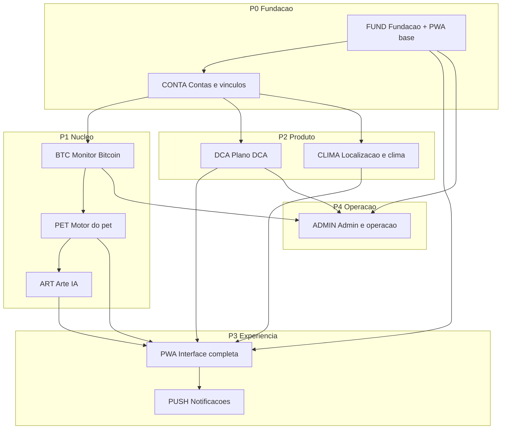

# Backlog de Implementação — Satoshi Pet Web

**Versão:** 1.0  
**Data:** 11/09/2026  
**Origem:** [PRD-Satoshi-Pet-Web-v2.0.md](../PRD-Satoshi-Pet-Web-v2.0.md)  
**Escopo:** produto completo (sem MVP)

---

## O produto principal é um PWA

O **Satoshi Pet Web** é um **Progressive Web App (PWA)** instalável — não um site com um app anexo. Toda a experiência do produto (dashboard do pet, modo display, notificações push, offline, instalação na tela inicial) é entregue pelo PWA Angular. O backend Quarkus existe para sustentar estado persistente, reconciliação Bitcoin, DCA, geração de arte e projeções públicas/privadas.

Essa premissa orienta prioridades, arquitetura e critérios de aceite de cada épico.

---

## Índice do backlog

| Arquivo | Épico | Prioridade |
|---------|-------|------------|
| [00-definicao-tecnica.md](./00-definicao-tecnica.md) | Stack, arquitetura, integrações, modelo de dados | Referência |
| [01-fundacao-e-infraestrutura.md](./01-fundacao-e-infraestrutura.md) | Fundação + base do PWA | P0 |
| [02-contas-e-vinculos.md](./02-contas-e-vinculos.md) | Conta, acesso, vínculo e troca de endereço | P0 |
| [03-monitor-bitcoin.md](./03-monitor-bitcoin.md) | Monitoramento e reconciliação Bitcoin | P1 |
| [04-motor-do-pet.md](./04-motor-do-pet.md) | Motor compartilhado do pet (alimentação, estados, ovo) | P1 |
| [05-arte-e-geracao-ia.md](./05-arte-e-geracao-ia.md) | Geração visual por IA e sprites | P1 |
| [06-dca-e-contabilidade.md](./06-dca-e-contabilidade.md) | Plano DCA, orçamento, compromissos, compras | P2 |
| [07-localizacao-e-clima.md](./07-localizacao-e-clima.md) | Localização, fuso, clima e ambiente | P2 |
| [08-interface-e-pwa.md](./08-interface-e-pwa.md) | **Produto principal:** interface completa do PWA | P0 → P3 |
| [09-notificacoes.md](./09-notificacoes.md) | Web Push e avisos | P3 |
| [10-admin-e-operacao.md](./10-admin-e-operacao.md) | Administração, auditoria, exclusão, operação | P4 |
| [11-criterios-de-aceite-e-qualidade.md](./11-criterios-de-aceite-e-qualidade.md) | Matriz CA-001..CA-070, SLOs e testes | Referência |

---

## Convenções

### Identificadores de história

Formato: `{ÉPICO}-{NN}`

| Prefixo | Épico |
|---------|-------|
| `FUND` | Fundação e infraestrutura |
| `CONTA` | Contas e vínculos |
| `BTC` | Monitor Bitcoin |
| `PET` | Motor do pet |
| `ART` | Arte e geração IA |
| `DCA` | DCA e contabilidade |
| `CLIMA` | Localização e clima |
| `PWA` | Interface e PWA |
| `PUSH` | Notificações |
| `ADMIN` | Admin e operação |

### Prioridades

| Nível | Significado |
|-------|-------------|
| **P0** | Bloqueante — fundação, base do PWA, contas |
| **P1** | Núcleo — Bitcoin, motor do pet, arte |
| **P2** | Produto — DCA, clima, ambiente |
| **P3** | Experiência completa — PWA avançado, notificações |
| **P4** | Operação — admin, observabilidade, backup |

### Estrutura de cada história

Cada história contém:

1. **Descrição** — o que entregar
2. **Regras de negócio** — referência à seção/CC do PRD
3. **Critérios de aceite** — referência a CA-xxx quando aplicável
4. **Dependências** — histórias ou épicos pré-requisitos
5. **Notas técnicas** — decisões de implementação

### Rastreabilidade

- **CA-xxx** — critérios de aceite verificáveis (seção 19 do PRD)
- **CC-xx** — critérios de consolidação (seção 20 do PRD)
- **§N** — seção do PRD v2.0

---

## Ordem de implementação por dependências

### Sequência recomendada (sprints lógicos)

1. **Sprint 0:** FUND-01..FUND-10 + shell PWA instalável (PWA-01..PWA-03)
2. **Sprint 1:** CONTA completo + página pública mínima (PWA-04)
3. **Sprint 2:** BTC monitor básico + PET reserva/estados + tela principal (PWA-05)
4. **Sprint 3:** PET ovo/nascimento/reorg + ART geração + animações (PWA-06..PWA-08)
5. **Sprint 4:** DCA completo + CLIMA + dashboard (PWA-09..PWA-11)
6. **Sprint 5:** PWA modo display, offline, acessibilidade + PUSH
7. **Sprint 6:** ADMIN, hardening, matriz CA completa e testes de aceite

> O PRD proíbe divisão em MVP. A sequência acima organiza dependências técnicas; **todo o escopo da seção 3 do PRD permanece obrigatório** antes do lançamento.

---

## Visão dos épicos

| Épico | Entrega principal | Histórias |
|-------|-------------------|-----------|
| Fundação | Monorepo, CI/CD, PostgreSQL, PWA base, segurança | ~12 |
| Contas | Magic link, recuperação, vínculo 72h, permissões | ~14 |
| Bitcoin | Esplora, mempool, reorg, backfill, recebimento lógico | ~16 |
| Motor do pet | Reserva 168h, estados, ovo, fonte alimentar CC-05 | ~18 |
| Arte IA | Pixel art, sprites, aprovação, object storage | ~10 |
| DCA | 11 faixas, ciclo 08h, orçamento, compras declaradas | ~20 |
| Clima | Geolocalização, fuso IANA, transições solares | ~10 |
| PWA | Tela principal, dashboard, QR, display, offline, a11y | ~22 |
| Notificações | Web Push, 4 categorias, idempotência | ~8 |
| Admin | Saúde, auditoria, exclusão CC-22, backup | ~10 |

---

## Desvio técnico registrado

A seção 16.1 do PRD registra "frontend React com TypeScript". Este backlog adota **Angular 22** como produto principal (PWA). Ver [00-definicao-tecnica.md](./00-definicao-tecnica.md) §1.1 e sugestão de ADR.

---

## Documentos relacionados

- [PRD-Satoshi-Pet-Web-v2.0.md](../PRD-Satoshi-Pet-Web-v2.0.md) — especificação funcional completa
- [00-definicao-tecnica.md](./00-definicao-tecnica.md) — stack, monorepo e o que o `.gitignore` exclui (§6.1)
- [11-criterios-de-aceite-e-qualidade.md](./11-criterios-de-aceite-e-qualidade.md) — matriz CA-001..CA-070
